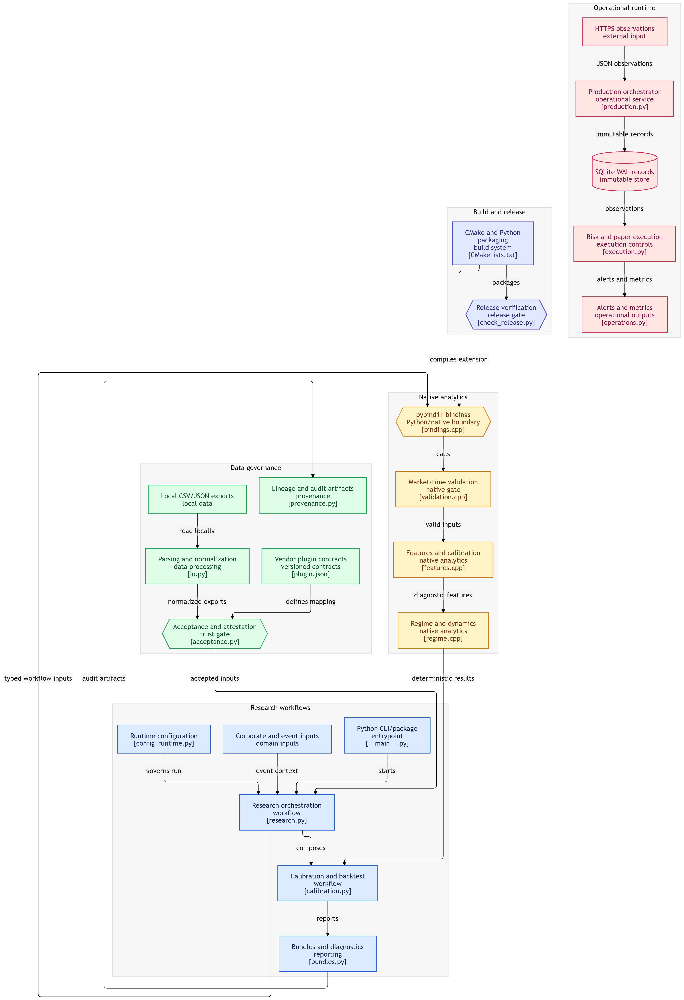

# Kraken v0.1.0: Point-in-Time Market Research Engine

> *"If markets are an ocean, the first rule is simple: do not pretend you can see through the fog with tomorrow’s data."*

## The Concept

Ever wanted to inspect market structure without turning a research notebook into a black box, a secret API collector, or a time machine? **Kraken** is a compact, local-first research toolkit that treats price movement, volatility, liquidity, and correlation as measurable market echoes.

Instead of pretending that a single score can predict every asset, Kraken makes the research boundary explicit. It validates what was knowable at each decision point, produces deterministic native calculations, measures empirical forecast coverage, and leaves an auditable provenance trail. Think of it as an underwater survey vessel for market structure, not an autopilot for trading.

The package is provided for research and educational use.

---

## Core Philosophy

| Feature | Description |
| --- | --- |
| **Compact Architecture** | A focused C++17 numerical core with a typed Python and pybind11 boundary. |
| **Deterministic Execution** | Identical inputs, configuration, and compiler policy produce reproducible outputs and checksums. |
| **Local-First Operation** | CSV and JSON inputs are supplied locally; Kraken does not scrape markets, request credentials, or transmit data. |
| **Point-in-Time Discipline** | Every observation has a market timestamp and an availability timestamp. Future or unavailable information is rejected. |
| **Walk-Forward Validation** | Training, validation, embargo, and evaluation partitions remain chronological. |
| **Empirical Uncertainty** | Forecast intervals come from historical horizon returns and report their supporting sample counts. |
| **Governed Data Lineage** | Licensed-data acceptance binds an explicit, expiring attestation to the exact manifest and every referenced file. |
| **Release Verification** | Source distributions and native wheels are checked for version, contents, plugin assets, and generated-artifact safety. |
| **No Trading Instructions** | Kraken reports research context. It does not create orders, portfolios, entries, exits, or investment recommendations. |

---



---

## Rigorous Testing Methodology

### Walk-Forward Validation

Kraken only lets a decision use observations that were available at that decision cutoff. When a forecast is evaluated, the later market outcome is kept outside the fitting history. This process repeats chronologically so the evaluation path does not quietly borrow future prices, revised events, or later data-vendor corrections.

The research runner separates contiguous training, embargo, validation, embargo, and evaluation partitions. The equity-options workflow applies the same discipline to known option quotes, corporate actions, distributions, earnings events, and explicit exchange-calendar sessions.

### Empirical Forecast Calibration

The sonar tracker constructs historical horizon-return distributions from eligible data. For each requested horizon it returns an empirical lower quantile, center, upper quantile, nominal coverage, and sample count. It does not assume that returns are normally distributed.

The calibration workflow replays chronological decisions and measures the realized later outcomes:

| Calibration Field | Meaning |
| --- | --- |
| **Nominal coverage** | Requested central coverage of the empirical interval. |
| **Empirical coverage** | Fraction of eligible later outcomes that fell inside the interval. |
| **Observation count** | Number of valid post-cutoff outcomes evaluated. |
| **Covered observation count** | Number of outcomes inside the interval. |
| **Mean interval width** | Average upper-minus-lower interval width. |

Run it with:

```bash
kraken calibration forecast \
  --input market.csv \
  --horizons 1,5,10 \
  --step 5 \
  --max-decisions 100 \
  --format json
```

A calibration report is evidence about the supplied historical sample. It is not a guarantee about a future market regime.

---

## What Kraken Produces

### Sonar Tracker

The Sonar Tracker reads timestamped `close`, `volume`, `realized_volatility`, and `liquidity` values. It produces multi-horizon echoes, signal strength, anomaly scores, and empirical forecast bands.

| Output | What It Means |
| --- | --- |
| **Echo displacement** | Log-price movement over a selected horizon. |
| **Signal strength** | Displacement scaled by current realized-volatility conditions. |
| **Anomaly score** | How unusual the latest eligible return looks relative to history. |
| **Forecast band** | An empirical quantile interval for a horizon log return. |
| **Sample count** | Number of historical horizon outcomes supporting the band. |

### Distance Calibration and Regime Risk

Kraken compares an evaluation segment with an earlier reference segment across return, realized volatility, liquidity, and liquidity-return correlation. The native core produces component distances, nearest-regime distance, reference-fit probability, uncertainty, drift, confidence, and a descriptive regime label.

| Regime | Interpretation |
| --- | --- |
| **Stable** | Current conditions remain comparatively close to the historical reference. |
| **Transitional** | Conditions have separated enough to warrant additional investigation. |
| **Stressed** | Combined anomaly, uncertainty, and distance are elevated. |
| **Dislocated** | The combined research score indicates weak historical resemblance. |

The confidence calculation uses a defined two-degree-of-freedom chi-square reference-fit probability. The labels remain research classifications, not trade signals.

### Marine Dynamics Diagnostics

The marine-dynamics deck provides transparent descriptive indices for liquidity and volatility structure. It contains hydrodynamic drag, tidal current, cavitation risk, buoyancy resilience, and a bounded composite dynamics score.

```bash
kraken dynamics assess \
  --input market.csv \
  --cutoff 2025-01-31T00:00:00Z \
  --reference-liquidity 2500000 \
  --drag-scale 1.0 \
  --fast-window 5 \
  --slow-window 20 \
  --format json
```

These are market-structure diagnostics. They are not return forecasts, probability estimates of profit, or portfolio recommendations.

---

## Data Integrity: No Look-Ahead Bias

Each observation needs two clocks: `timestamp` says when the measurement belongs in market time, while `available_at` says when a researcher could have known it. Kraken validates the full supplied input before feature filtering.

A run fails for a future record, unavailable information, non-monotonic chronology, invalid availability ordering, missing required fields, non-finite numbers, invalid market values, or insufficient history. The system does not silently delete invalid data and continue as though nothing happened.

| Control | Kraken’s Behaviour |
| --- | --- |
| **Availability timestamps** | Rejects values that were unavailable at the decision cutoff. |
| **Chronological ordering** | Requires strictly increasing market timestamps. |
| **Decision cutoffs** | Bounds native feature computation and evaluation. |
| **Embargo gaps** | Separates information partitions around evaluation boundaries. |
| **Corporate actions** | Reconciles known split factors with option strike and multiplier adjustments. |
| **Distributions** | Checks point-in-time availability, uniqueness, and raw-price sanity. |
| **Earnings events** | Prevents future revisions from entering earlier historical decisions. |
| **Calendar controls** | Optionally validates sessions, half days, stale snapshots, halts, and chain completeness. |
| **Survivorship disclosure** | Warns when historical-universe controls are not documented. |

---

## Equity-and-Options Historical Research

Kraken includes a local equity-options calibration workflow. It validates every supplied quote, selects only contracts known at the decision cutoff and not yet expired, and compares a later realized underlying move with the known implied move.

| It Reports | It Does Not Report |
| --- | --- |
| Historical contract metadata | Trade entries or exits |
| Known implied move | Portfolio allocation |
| Post-cutoff realized log move | Simulated orders or fills |
| Implied-move coverage | P&L, Sharpe, or strategy performance |
| Regime and dynamics context | Investment advice |

```bash
kraken backtest options \
  --equity-input equity_history.csv \
  --options-input option_quotes.csv \
  --train-size 120 \
  --validation-size 40 \
  --holding-size 20 \
  --embargo-size 2 \
  --universe-id documented-universe \
  --survivorship-controlled \
  --format json
```

This is historical calibration research. It does not model exercise, assignment, dividends, tax treatment, execution, slippage, or any option strategy.

---

## Licensed Data and Governance

Kraken does not ship a pretend licensed dataset, provider credential, or remote connector. The file-backed vendor adapter accepts only local exports that the operator is authorized to use.

Authorized acceptance requires three local artifacts: a vendor manifest, an explicit exchange calendar, and an authorization attestation. The attestation must identify the authorizer and license, contain a future expiry timestamp, bind to the exact vendor manifest with a SHA-256 digest, and contain exactly one lowercase SHA-256 digest for every referenced input file.

Generate the hash-bound attestation with:

```bash
python tools/create_authorization_attestation.py \
  --manifest authorized_vendor_manifest.json \
  --authorized-by data-governance-owner \
  --license-name "Authorized vendor research license" \
  --expires-at 2027-01-01T00:00:00Z \
  --expected acceptance_expected.json \
  --output authorized_acceptance.json
```

Then run the fail-closed acceptance harness:

```bash
python tools/run_licensed_acceptance.py \
  --manifest authorized_vendor_manifest.json \
  --authorization authorized_acceptance.json \
  --calendar authorized_exchange_calendar.json
```

The acceptance report retains the license identity, authorization owner, timestamps, authorization-file hash, manifest hash, and input-file hashes. These hashes prove file identity and lineage; they do not independently grant a legal license or determine whether a vendor’s historical universe is economically complete.

---

## Provider Export Normalizers

Licensed vendors use different column names for the same economic fact. Kraken discovers strict versioned mapping plugins from `vendor_plugins/<provider>/<version>/` and maps declared provider columns into the canonical local schema.

| Profile | Typical Equity Fields | Typical Option Fields |
| --- | --- | --- |
| `canonical` | `timestamp`, `available_at`, `close` | Canonical Kraken option fields. |
| `snapshot_v1` | `event_time`, `published_at`, `settle`, `rv_20d` | `expiry`, `symbol`, `right`, `exercise_price`, `iv`. |

```bash
kraken vendor normalize \
  --mapping-file vendor_mappings/licensed_snapshot_v1.json \
  --equity-source provider_equity.csv \
  --options-source provider_options.csv \
  --output-directory normalized_export \
  --format json
```

The normalizer validates every output row, records the plugin version and SHA-256 fingerprint, and refuses incomplete or inconsistent plugin contracts. Built-in plugin assets are included in release wheels.

---

## Verification Snapshot

The current repository was locally verified on Linux with CPython 3.12. The release workflow extends this with hosted packaging jobs for Ubuntu, macOS, and Windows across CPython 3.10, 3.11, and 3.12.

| Check | Result |
| --- | --- |
| Native C++17 build | Passed |
| Native CTest suite | Passed |
| Python and CLI tests | **55 tests passed** |
| Empirical calibration CLI | Passed on the deterministic fixture |
| Benchmark comparison | Passed with matching compiler and checksums |
| Linux CPython 3.12 wheel | Passed |
| Isolated wheel smoke test | Passed, including vendor-plugin discovery and normalization |
| Source distribution | Passed, including vendor plugins and artifact-safety checks |
| Release verifier | Passed for version, contents, hashes, and archive safety |
| Cross-platform CI matrix | Configured for Ubuntu, macOS, and Windows with Python 3.10–3.12 |
| Source comment audit | Passed with no comments added to modified code |

---

## Technical Specifications

| Layer | Implementation |
| --- | --- |
| **Native core** | Modular deterministic C++17 implementation. |
| **Python boundary** | Typed frozen dataclasses and pybind11 bindings. |
| **Input formats** | Local CSV and JSON market, option, corporate-action, distribution, earnings, calendar, and manifest files. |
| **Configuration** | Versioned strict `ResearchConfig` `.kcfg` files. |
| **Forecast intervals** | Interpolated empirical quantiles of historical horizon returns. |
| **Provenance** | SHA-256 configuration, input, output, vendor, report, bundle, and release-artifact fingerprints. |
| **Packaging** | `scikit-build-core`, CMake, pybind11, source distribution, native wheels, and release checksums. |
| **Supported Python** | 3.10, 3.11, and 3.12. |

### Native Modules

| Module | Responsibility |
| --- | --- |
| `numeric.cpp` | Stable statistics, empirical quantiles, clamping, correlation, and finite-value checks. |
| `validation.cpp` | Cutoff, availability, chronology, and market-value gates. |
| `features.cpp` | Return, volatility, liquidity, and correlation series. |
| `sonar.cpp` | Echoes, anomalies, and empirical forecast bands. |
| `calibration.cpp` | Distance, reference-fit probability, confidence, and drift. |
| `regime.cpp` | Descriptive regime classification. |
| `dynamics.cpp` | Drag, tidal, cavitation, buoyancy, and composite diagnostics. |

---

## Installation

Kraken requires Python 3.10 or newer, CMake 3.20 or newer, and a C++17 compiler for source builds.

```bash
python -m pip install .
```

For editable development:

```bash
python -m pip install -e .[dev]
python -m unittest discover -s tests -v
```

Build and verify release artifacts locally:

```bash
python -m build --outdir dist
python tools/check_release.py --dist dist --tag v0.1.0
cat dist/SHA256SUMS
```

The GitHub Actions workflow runs native quality checks on Ubuntu and builds wheel smoke-test jobs on Ubuntu, macOS, and Windows across the supported Python versions. A matching `v*` tag publishes artifacts only after the release verifier passes.

---

## Production Runtime

Kraken now includes a fail-closed operational runtime in `src/kraken/production.py`, `src/kraken/risk.py`, `src/kraken/execution.py`, and `src/kraken/operations.py`. It supports HTTPS JSON observation ingestion, exponential retries, immutable SQLite WAL storage, JSONL alerts, Prometheus-compatible metrics, health and readiness endpoints, persistent risk counters, and append-only execution audit logs.

The runtime is **paper-first**. `PaperBroker` is the included broker, while `LiveBrokerNotConfigured` refuses live orders until a provider-specific adapter, credential policy, independent model and risk review, kill-switch test, and deployment approval exist. Risk controls enforce maximum order, position, gross exposure, daily loss, daily order count, stale-quote, and slippage limits. A persistent kill switch forces readiness failure and rejects new orders.

Run the containerized runtime with the instructions in [`deploy/README.md`](deploy/README.md). Do not expose operational endpoints publicly without TLS, network authentication, and an approved secret-management path.

## Release Certification

The release verifier requires exactly one source distribution and at least one wheel. It checks that the artifacts match the project version, contain the native extension and vendor plugins, exclude generated artifacts from the source distribution, and have a generated SHA-256 checksum file.

The clean source archive is assembled without native build outputs, Python caches, compiled objects, or managed metadata. The release artifacts contain the platform-specific wheel, source distribution, and `SHA256SUMS` file.

---

## Future Roadmap

The project’s next research improvements are empirical rather than cosmetic: expand calibration reports with user-defined acceptance thresholds, add richer historical-universe controls, extend vendor acceptance contracts, and collect hosted CI evidence for every matrix target. None of these items changes the research-only scope of the package.

---

## Contributing and Research Collaboration

Contributions are welcome for native numerical validation, point-in-time data-quality controls, provider mapping contracts, reproducibility tooling, cross-platform packaging, and alternative empirical evaluation methods.

Please keep changes deterministic, preserve chronology and availability checks, add regression coverage for new behavior, and avoid embedding proprietary or unlicensed datasets in the repository.

---

## License and Usage

This repository is distributed under the MIT License and is intended for **research and educational purposes only**.

**What This Is:**

- A deterministic market-structure research toolkit.
- An example of point-in-time and walk-forward validation.
- A framework for empirical forecast-band calibration and provenance tracking.
- A local adapter contract for authorized licensed exports.

**What This Is Not:**

- Investment advice.
- Financial guidance.
- Trading recommendations.
- A live trading system.
- A guarantee of future performance.
- A substitute for licensed-data governance.

---

## Important Disclaimers

**Historical data is not a promise about future outcomes.** Markets evolve, liquidity changes, reporting practices shift, and correlations change during stress.

**Empirical coverage is sample-dependent.** A forecast interval that covered a historical sample at its nominal rate may not do so in another market, asset, or regime.

**Attestation is not a license.** Cryptographic lineage confirms which files were reviewed. It does not establish legal entitlement or vendor completeness.

**Simulation is not execution.** Real-world trading introduces costs, slippage, latency, liquidity constraints, operational risk, and model risk that this research toolkit does not simulate as a trading engine.

**Kraken is research and analysis only, not personalized financial advice.**

---

## Project Layout

| Path | Purpose |
| --- | --- |
| `cpp/` | Deterministic C++17 numerical core and pybind11 bindings. |
| `cpp/tests/` | Native CTest coverage. |
| `cpp/benchmarks/` | Deterministic large-history benchmark. |
| `configs/` | Versioned native research configurations. |
| `src/kraken/` | Typed Python API, parsers, audits, workflows, calibration, and CLI. |
| `vendor_plugins/` | Versioned provider mappings and plugin contracts. |
| `fixtures/` | Clearly labeled illustrative test inputs. |
| `tests/` | Python, integrity, governance, calibration, and packaging tests. |
| `tools/check_release.py` | Source and wheel release-artifact verifier. |
| `tools/run_production.py` | Container-friendly ingestion, monitoring, and paper-execution runtime. |
| `deploy/` | Non-root container definition and production operations runbook. |
| `tools/create_authorization_attestation.py` | Licensed-data hash-bound attestation generator. |
| `tools/wheel_smoke.py` | Installed-wheel smoke test. |
| `.github/workflows/native-quality.yml` | Native quality, packaging matrix, and tag release workflow. |
| `CMakeLists.txt` and `pyproject.toml` | Native extension and Python package build configuration. |

---

## Conclusion

Kraken is a strict, local-first framework for studying market structure without pretending that tomorrow’s data was available yesterday. Its value is not a flashy performance claim. Its value is a reproducible boundary: data is checked, chronology is enforced, uncertainty is measured empirically, licensed inputs are fingerprinted, and release artifacts are verified.

*Release the Kraken. Just do not let it borrow tomorrow’s data.*
